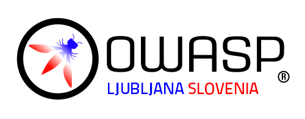

---

layout: col-sidebar
title: OWASP Ljubljana
tags: Ljubljana
region: Europe
country: Slovenia
postal-code: 1000
meetup-group: owasp-ljubljana-chapter

---

## Welcome to OWASP Ljubljana
Welcome to OWASP Ljubljana chapter homepage. The chapter leaders are <a href="mailto:bostjan.spehonja@owasp.org">Boštjan Špehonja</a> and <a href="mailto:mitja.trampuz@owasp.org">Mitja Trampuž</a>

## Call For Speakers
Call For Speakers is open. If you would like to present a talk on Application Security at future OWASP Ljubljana Chapter events - please  review and agree with the OWASP Speaker Agreement and send the proposed talk title, abstract, and speaker bio to the Chapter Leaders via e-mail.

## Participation
The Open Worldwide Application Security Project (OWASP) is a nonprofit foundation that works to improve the security of software. All of our projects ,tools, documents, forums, and chapters are free and open to anyone interested in improving application security. 

Chapters are led by local leaders in accordance with the [Chapters Policy](/www-policy/operational/chapters). Financial contributions should only be made online using the authorized online donation button. 

Everyone is welcome and encouraged to participate in our [Projects](/projects/), [Local Chapters](/chapters/), [Events](/events/), [Online Groups](https://groups.google.com/a/owasp.com/){:target='_blank'}, and [Community Slack Channel](https://owasp.slack.com/){:target='_blank'}. We especially encourage diversity in all our initiatives. OWASP is a fantastic place to learn about application security, to network, and even to build your reputation as an expert. We also encourage you to be [become a member](/membership/) or consider a [donation](/donate/) to support our ongoing work.

We will be running a Chapter Meetup every 2-3 months with the option to have additional events such as hands-on workshops. It will be a mix of in-person and virtual meetups. All our upcoming events are announced on Meetup.

## Upcoming meetings



