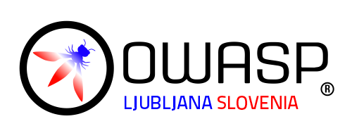

---

title: Events
layout: null
tab: true
order: 2
tags: Ljubljana
meetup group: owasp-ljubljana-chapter

---

## Events

**1. Opening session OWASP Ljubljana - Post quantum cryptography - 9.11.2023 16:30 (Online)**
 * Speakers: dr. Nastja Cepak
 * Location: Online - TBA
 * Description: Kriptografija je učinkovit način za zaščito zaupnosti in celovitosti informacij ter zaščito informacijskih sistemov pred kibernetskimi grožnjami. Kvantno računalništvo grozi, da bo razbilo večino današnje kriptografske zaščite. Čeprav že prihajajo poročila o prvih poskusih zloma uveljavljenih kriptografskih algoritmov, kvantni računalniki, ki so na voljo ta trenutek, v splošnem še niso dovolj zmogljivi, da bi jih razbili.

**2. Cryptography - TBA 16:30 (Hybrid)**
 * Speakers: dr. Nastja Cepak
 * Location: Offline and online - TBA
 * Description: TBA

**3. OWASP TOP 10 - TBA 16:30 (Hybrid)**
 * Speakers: Boštjan Špehonja
 * Location: Offline and online - TBA
 * Description: We are going to walk through most common vulnerabilities in web applications discovered in penetragtion testing

## Past events
